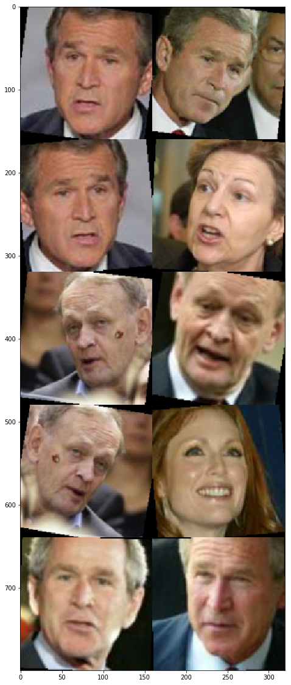
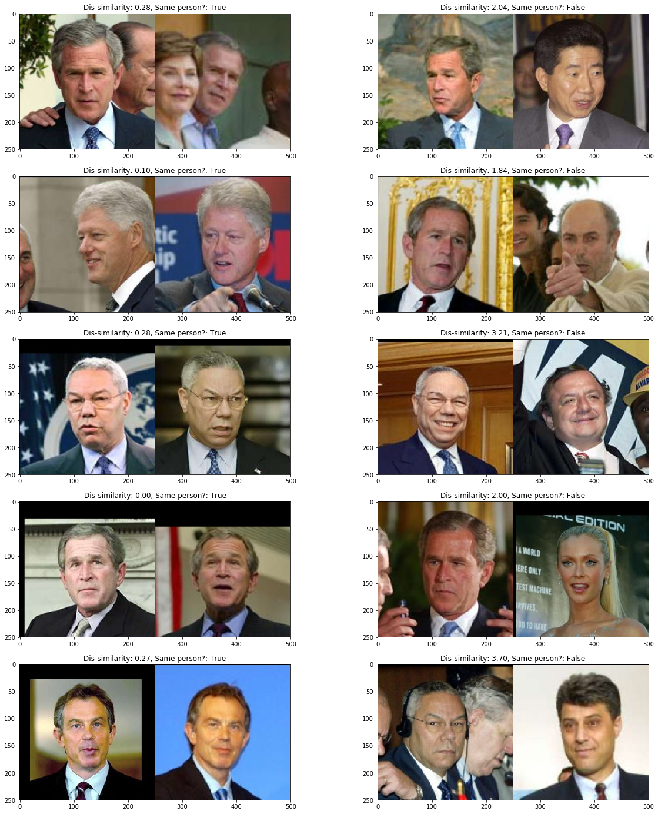
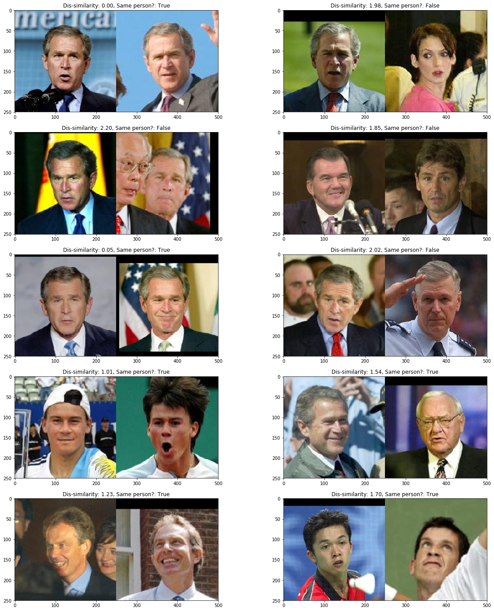
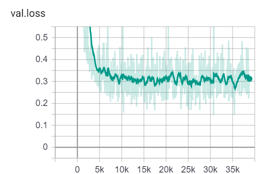

# Face Similarity using PyTorch

## Using
### Requirements
1. Python >= 3.6

### Usage
1. Clone the github repo
    ```bash
    git clone https://github.com/anujkhare/face-similarity-pytorch.git
    cd face-similarity-pytorch
    ```
2. Install requirements:
    ```
    pip install -r requirements.txt
    ```
3. Run the inference script:
    ```bash
    python predict.py -img1 <path-to-image-1> -img2 <path-to-image-2>
    ```

    Run `python predict.py --help` for more options.

### Training
Use the jupyter notebook `train-siamese.ipynb`.

## Details

### Approach
I used a Siamese network along with contrastive loss for learning
(dis)similarity between image pairs.

Refer to `src` for details and the code.

#### Data split
Only used the LFW data set.
1. Randomly separate all images of some people for the test set
2. From all images in the training part, split out training/validation image sets

The held-out set will contain people that the model would have never
seen during training/validation.

#### Pre-processing / augmentations
1. Use [dlib]() face detection to crop a tight bbox around the face.
    Expand the b-box by 20% on all sides to incorporate more context.
2. Apply some random transformations (horizontal flip, rotations)
3. Resize and/or pad to `160 * 160`

#### Labels and Sampling
Given two images, the label is defined as:
- 0: if the images belong to different people
- 1: if the images belong to the same person

We'll pick up pairs of images from the given set using the following strategy:
1. Positive pair: pick the next positive pair from all the available pairs
2. Negative pair: for one of the images picked for the positive pair,
    find a random negative image

Below are some sample pre-processed pairs:



Each row is a pair, every alternate row starting with the first is a
positive pair.

#### Choosing a threshold
1. Find the predicted distances on validation set pairs
2. Choose a distance threshold that maximizes the F1

### Sample Outputs

From the train set:



From the val set:



From the test set:


## Notes
### The model is overfitting significantly!
Loss curves:





Usinng threshold=1.5:

| Data split | F1 | N-pairs |
| --- | --- | --- |
| Train | 98.74% | 12000 | 
| Val |  93.81% | 12000 |
| Test | 57.61% | 420 |


### Contrastive loss vs Triplet loss
The [FaceNet]() paper as well as the implementation in
[OpenFaces](https://openface-api.readtheoutputs.io) use a "triplet loss"
for the metric learning. I chose

### Better sampling strategies
Presently, I am sampling all possible positive pairs and an equal number
of randomly chosen negative pairs.

Better sampling strategies or online hard example mining would improve
results.

### Pre-trained models
I didn't use any pre-trained models since accuracy was not the main
focus here. If needed, [VGG-Face](https://github.com/ox-vgg/vgg_face2)
seems like a great choice!
